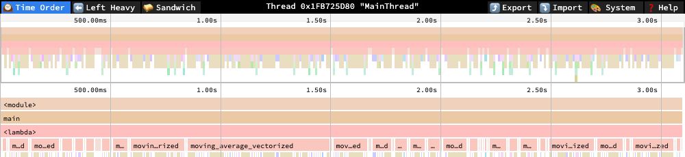

# measured-speedup-harness

A harness for verifying that a code change is actually faster, not just
faster on one lucky run.

**3 seconds of wall-clock time, same profiler, same window, two implementations of the same function:**

<table>
<tr>
<th>Baseline — naive loop</th>
<th>Optimized — cumsum-based</th>
</tr>
<tr>
<td></td>
<td></td>
</tr>
</table>

Left: one continuous call to `moving_average_naive` fills the entire
3-second window — it's still running the same invocation when the capture
ends. Right: the same 3 seconds fits thousands of complete calls to
`moving_average_vectorized`, each one a full round trip through numpy's
internals (visible as the dense, colorful churn instead of one flat bar).
That density difference *is* the speedup — not a percentage on a page, a
visibly different number of times the same work got done in the same
window. [Explore both profiles interactively](#profiling-what-actually-changed).

## Why this exists

A single before/after timing is not evidence. Two runs of identical,
unchanged code can differ by 20-30% from cache state, GC pauses, scheduler
jitter, and thermal throttling alone. Most incorrect "this is faster"
claims trace back to one of two causes: nobody checked the output was still
correct, or nobody accounted for run-to-run variance before calling the
result real. Both are cheap to catch up front and expensive to find out
about later — either as a correctness regression that shipped because the
fast path skipped an edge case, or a benchmark result that quietly stops
holding up the next time someone reruns it.

This harness enforces three things, in order, before a speedup is allowed
to be called real:

1. **Correctness first.** Baseline and candidate outputs are compared
   before any timing is trusted. A fast, incorrect implementation is
   rejected outright — its timing is not evaluated.
2. **Interleaved trials, not two separate blocks.** Baseline and candidate
   calls alternate (A, B, A, B, ...) instead of timing all of one and then
   all of the other. If the machine slows down over the course of the run
   — thermal throttling, memory pressure — that drift affects both arms
   roughly equally instead of penalizing whichever one ran second.
3. **A decision rule fixed in advance.** A result is only marked
   `confirmed` if it clears both a minimum effect size (5% by default) and
   a statistical margin (a Welch's t-test against the variance in both
   samples). A lower mean by itself is not sufficient.

## What it produces

Each comparison renders as a **finding**: what was compared, whether it was
correct, the measured numbers, and a confidence tier — not a bare
percentage with no basis behind it.

```
## Replace naive O(N*W) sliding-sum loop with O(N) cumsum-based moving average
- target: moving average, N=4000, window=50
- confidence: confirmed
- correctness: pass (max abs diff = 2.89e-14, rtol=1e-6)
- baseline: 14.7356 ms +/- 0.3006 ms (n=25)
- optimized: 0.0393 ms +/- 0.0138 ms (n=25)
- speedup: 99.7% (t=244.17), 95% CI [99.7%, 99.8%]
- decision_rule: correctness gate; min_speedup_pct=5.0; t_threshold=2.0 (Welch's t, 25 interleaved trials)
- source: example_moving_average.py, run locally, no external deps beyond numpy
```

The 95% CI comes from bootstrap resampling of the trial data, alongside
the Welch's t-test. The t-test assumes roughly normal timing distributions;
real timing data is often right-skewed (most calls cluster near a floor,
with occasional slow outliers from GC or OS scheduling), so the bootstrap
interval is reported as a second, distribution-free view of the same
question rather than a replacement for the t-test.

| Tier | Meaning |
|---|---|
| `fail` | Outputs didn't match. Timing is not evaluated. |
| `noise` | Outputs matched, but the speedup is below the minimum threshold. |
| `marginal` | Speedup clears the threshold but isn't statistically distinguishable from sample noise yet. |
| `confirmed` | Clears both the effect-size threshold and the statistical margin. |

Findings accumulate in `findings.md` as a running log. The tiering is what
keeps that log honest over time: if a change marked `confirmed` stops
holding up under different conditions, that shows up as a new, lower-tier
entry rather than as a silently stale claim.

## Where this applies

The harness is deliberately generic — anything with a baseline
implementation, a candidate implementation, and a way to check they agree.
Some concrete cases it's suited for:

- **Serialization format changes** — e.g. switching a hot path from JSON to
  a binary format. Correctness check confirms round-trip equality; the
  harness confirms the encode/decode time actually improved and by how
  much, before the format change goes into a PR description.
- **Data structure swaps** — e.g. replacing a list-based lookup with a set
  or dict for membership checks. Easy to assume it's faster; the harness
  catches the case where the collection is small enough that the overhead
  of the new structure erases the algorithmic win.
- **Caching or memoization additions** — confirms the cached path returns
  identical results to the uncached one (a common source of silent
  staleness bugs) and quantifies the actual hit-path speedup, since cache
  effects are exactly the kind of thing that looks great on a warm run and
  disappears under real trial-to-trial variance.
- **Library or dependency upgrades** — e.g. a new major version of a
  parsing or numerical library that claims to be faster. Running both
  versions through the same harness turns a changelog claim into a
  measured one, on your actual workload rather than the library's own
  benchmark suite.
- **Vectorizing a loop** (the worked example in this repo) — replacing a
  Python-level loop with a NumPy/vectorized equivalent. The speedup is
  usually large and easy to confirm, but the correctness gate still
  matters: vectorized rewrites are a common place to introduce off-by-one
  or edge-case bugs at array boundaries.
- **Regression protection over time** — the same comparison can be re-run
  on every change to a hot path, so a `confirmed` speedup that later
  degrades to `noise` (a dependency update, a platform change, an
  unrelated code change nearby) is caught the same way a test suite catches
  a correctness regression.
- **Scaling this to a real ML migration** — a framework version bump, a new
  hardware backend, or a compiler upgrade doesn't touch one kernel, it
  touches dozens to hundreds of model subgraphs at once. The question stops
  being "is this op faster" and becomes "how many of these are still
  correct, how many actually got faster, and which ones need a human to
  look at them." `run_suite.py` runs the same correctness-gate-then-measure
  discipline across a whole batch of comparisons and reports counts by
  tier instead of requiring someone to read N individual write-ups — see
  below.

### Scaling to a batch of comparisons

```
python3 run_suite.py example_moving_average example_matmul --ledger-file findings.jsonl
```

```
Suite summary: 2 confirmed

| scenario | tier | speedup | correctness |
|---|---|---|---|
| example_moving_average | confirmed | 99.7% | pass |
| example_matmul | confirmed | 100.0% | pass |
```

A scenario that fails to import or crashes mid-run doesn't abort the
batch — that would defeat the point of running many at once. It shows up
as its own `error` row in the summary, same as a `fail`, `noise`, or
`marginal` tier would, so a migration touching 200 kernels surfaces "3
errored, 12 regressed to noise, 185 confirmed" as one glance instead of
200 separate reports. Pair with `--ledger-file` and `regression_check.py`
to catch a kernel that was `confirmed` on the last migration pass quietly
becoming `noise` on this one.

## Using it

```python
from harness import compare, render_finding

result = compare(
    baseline_fn=my_baseline,       # () -> output
    optimized_fn=my_candidate,     # () -> output
    check_equivalent=my_check,     # (baseline_out, optimized_out) -> (bool, str)
    n_trials=30,
    warmup=5,
    min_speedup_pct=5.0,
    t_threshold=2.0,
)
print(render_finding(result, technique="...", target="...", source="..."))
```

`example_moving_average.py` (memory-bound) and `example_matmul.py`
(compute-bound) are fully worked examples. Both run standalone:

```
python3 example_moving_average.py
python3 example_matmul.py
```

Or run either through the CLI, which works against any module exposing
`BASELINE_FN`, `OPTIMIZED_FN`, `CHECK_EQUIVALENT`, `TECHNIQUE`, `TARGET`,
and `SOURCE`:

```
python3 bench.py example_moving_average --n-trials 50 --min-speedup 3
python3 bench.py example_matmul
python3 bench.py example_moving_average --plot moving_average.png
```

`--plot` saves a histogram of the baseline/optimized trial distributions.
The numbers in a finding are the rigorous version of the argument; the
plot is the fast version — useful when the audience wants to see that the
two distributions don't overlap rather than parse a decision rule.

Both examples double as the reference for wiring up a new comparison —
write a module with the six attributes above and `bench.py` runs it the
same way, without touching `harness.py`.

The one-off correctness check inside `compare()` only checks the specific
input each example happens to use. `tests/` runs the two implementations
against hundreds of generated inputs (via Hypothesis) to catch the boundary
cases a hand-picked example would miss — this is how the precision limit
documented in `moving_average_vectorized` was actually found, not
guessed at in advance:

```
pip install -r requirements-dev.txt
pytest tests/
```

## Profiling: what actually changed

The harness answers "is it faster and by how much," deliberately not
"why" — guessing why from a timing number alone is how optimization effort
gets spent in the wrong place. `profile.py` captures a py-spy profile of a
scenario's baseline or optimized path so that question gets answered by
looking, not assuming:

```
sudo python3 profile.py example_moving_average --which baseline --out examples/baseline.speedscope.json
sudo python3 profile.py example_moving_average --which optimized --out examples/optimized.speedscope.json
```

`py-spy` needs root on macOS to attach to a process, even one it launches
itself. Default output is [speedscope](https://www.speedscope.app/) format
rather than a flamegraph SVG — GitHub strips the `<script>` an SVG
flamegraph needs for zoom/search out of anything rendered inline, so that
interactivity is lost the moment it's viewed on GitHub. speedscope.app can
load a profile straight from a URL and keeps its full interactivity there:

- [Baseline profile](https://www.speedscope.app/#profileURL=https://raw.githubusercontent.com/RyanJHamby/measured-speedup-harness/main/examples/baseline.speedscope.json&title=baseline)
- [Optimized profile](https://www.speedscope.app/#profileURL=https://raw.githubusercontent.com/RyanJHamby/measured-speedup-harness/main/examples/optimized.speedscope.json&title=optimized)

**What these actually show, leaf-frame sample counts:**

Baseline (n=303): 99.7% of samples land in `moving_average_naive` itself —
confirms the naive loop's cost is exactly where you'd expect, not spread
across surrounding overhead.

Optimized (n=310): only 13.2% of samples are in `moving_average_vectorized`
directly. The plurality — 55.5% in `_wrapfunc`, 18.7% in `insert`, 8.7% in
`normalize_axis_tuple` — is numpy's internal argument-dispatch machinery
for `np.insert(data, 0, 0.0)`, not the `cumsum` arithmetic (2 samples).
That's a genuine second-order finding the profiler surfaced and a hand-wave
explanation ("vectorized code is faster") would have missed: at this array
size, the remaining cost in the "fast" path is call overhead from prepending
one element, not computation. A further optimization, if it mattered at
this scale, would preallocate the output array and write the running sum
into it directly instead of calling `np.insert`.

## Tracking results over time

A `confirmed` speedup isn't permanent — a dependency upgrade, a different
machine, or an unrelated nearby change can erode it. `bench.py --ledger-file`
appends a machine-readable JSON record per run (timestamp, tier, speedup,
CI) alongside the human-readable `findings.md`:

```
python3 bench.py example_moving_average --ledger-file findings.jsonl
```

`regression_check.py` reads that ledger, groups records by comparison, and
flags any case where the most recent run's tier ranks lower than the one
before it for the same comparison — the same idea as a flaky-test
detector, applied to performance claims instead of correctness:

```
python3 regression_check.py findings.jsonl
```

## Design intent

The three-step discipline here — verify correctness, measure past noise,
decide the bar in advance — is the part meant to generalize. The moving
average example is incidental; the same approach applies to comparing two
implementations of anything, at any scale, where "is this actually faster"
needs to be answered with evidence rather than a single timestamp diff.
