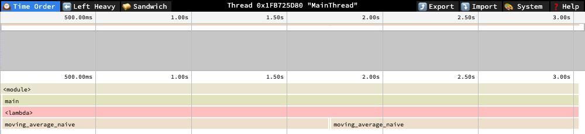

# measured-speedup-harness

[](https://github.com/RyanJHamby/measured-speedup-harness/actions/workflows/ci.yml)

A harness for verifying that a code change is actually faster, not just
faster on one lucky run.

**3 seconds of wall-clock time, same profiler, same window, two implementations of the same function:**

<table>
<tr>
<th>Baseline — naive loop</th>
<th>Optimized — cumsum-based</th>
</tr>
<tr>
<td></td>
<td></td>
</tr>
</table>

Left: one continuous call to `moving_average_naive` fills the entire
3-second window — it's still running the same invocation when the capture
ends. Right: the same 3 seconds fits thousands of complete calls to
`moving_average_vectorized`, each one a full round trip through numpy's
internals (visible as the dense, colorful churn instead of one flat bar).
That density difference *is* the speedup — not a percentage on a page, a
visibly different number of times the same work got done in the same
window. [Explore both profiles interactively](#profiling-what-actually-changed).

## Why this exists

A single before/after timing is not evidence. Two runs of identical,
unchanged code can differ by 20-30% from cache state, GC pauses, scheduler
jitter, and thermal throttling alone. Most incorrect "this is faster"
claims trace back to one of two causes: nobody checked the output was still
correct, or nobody accounted for run-to-run variance before calling the
result real. Both are cheap to catch up front and expensive to find out
about later — either as a correctness regression that shipped because the
fast path skipped an edge case, or a benchmark result that quietly stops
holding up the next time someone reruns it.

This harness enforces three things, in order, before a speedup is allowed
to be called real:

1. **Correctness first.** Baseline and candidate outputs are compared
   before any timing is trusted. A fast, incorrect implementation is
   rejected outright — its timing is not evaluated.
2. **Interleaved trials, not two separate blocks — with the order inside
   each pair randomized.** Baseline and candidate calls alternate (A, B,
   A, B, ...) instead of timing all of one and then all of the other, so
   drift over the run (thermal throttling, memory pressure) affects both
   arms roughly equally. Which one runs first within a given pair is also
   randomized per trial, so an implementation that's always fast or slow
   purely because of its fixed position (whatever benefits from — or
   inherits stale cache/branch-predictor state from — running right after
   its neighbor) can't be mistaken for a real speedup.
3. **A decision rule fixed in advance.** A result is only marked
   `confirmed` if it clears both a minimum effect size (5% by default) and
   a statistical margin (a Welch's t-test against the variance in both
   samples). A lower mean by itself is not sufficient.

## What it produces

Each comparison renders as a **finding**: what was compared, whether it was
correct, the measured numbers, and a confidence tier — not a bare
percentage with no basis behind it.

```
## Replace naive O(N*W) sliding-sum loop with O(N) cumsum-based moving average
- target: moving average, N=4000, window=50
- confidence: confirmed
- correctness: pass (max abs diff = 2.89e-14, rtol=1e-6)
- baseline: 14.2959 ms +/- 0.4318 ms (n=25), p50/p95/p99 = 14.0937/15.2996/15.3906 ms
- optimized: 0.0363 ms +/- 0.0054 ms (n=25), p50/p95/p99 = 0.0345/0.0458/0.0487 ms
- speedup: 99.7% (t=165.11, df=24.0, p=3.4e-38), 95% CI [99.7%, 99.8%]
- decision_rule: correctness gate; min_speedup_pct=5.0; t_threshold=2.0 (Welch's t, 25 interleaved trials)
- source: scenarios/moving_average.py, run locally, no external deps beyond numpy
```

The 95% CI comes from bootstrap resampling of the trial data, alongside
the Welch's t-test. The t-test assumes roughly normal timing distributions;
real timing data is often right-skewed (most calls cluster near a floor,
with occasional slow outliers from GC or OS scheduling), so the bootstrap
interval is reported as a second, distribution-free view of the same
question rather than a replacement for the t-test.

The mean and stdev answer "is this faster on average" — the right
question for most code, but the wrong one for anything latency-sensitive,
where an occasional slow call matters more than the average call. p50/p95/p99
are reported alongside for that case. With the trial counts used by
default here (20-30), treat p99 as directional, not precise: estimating a
99th-percentile tail reliably needs closer to hundreds of trials, not
tens — with n=25, p99 is close to just the single slowest observed sample.

| Tier | Meaning |
|---|---|
| `fail` | Outputs didn't match. Timing is not evaluated. |
| `noise` | Outputs matched, but the speedup is below the minimum threshold. |
| `marginal` | Speedup clears the threshold but isn't statistically distinguishable from sample noise yet. |
| `confirmed` | Clears both the effect-size threshold and the statistical margin. |

Findings accumulate in `findings.md` as a running log. The tiering is what
keeps that log honest over time: if a change marked `confirmed` stops
holding up under different conditions, that shows up as a new, lower-tier
entry rather than as a silently stale claim.

## Where this applies

The harness is deliberately generic — anything with a baseline
implementation, a candidate implementation, and a way to check they agree.
Some concrete cases it's suited for:

- **Serialization format changes** — e.g. switching a hot path from JSON to
  a binary format. Correctness check confirms round-trip equality; the
  harness confirms the encode/decode time actually improved and by how
  much, before the format change goes into a PR description.
- **Data structure swaps** — e.g. replacing a list-based lookup with a set
  or dict for membership checks. Easy to assume it's faster; the harness
  catches the case where the collection is small enough that the overhead
  of the new structure erases the algorithmic win.
- **Caching or memoization additions** — confirms the cached path returns
  identical results to the uncached one (a common source of silent
  staleness bugs) and quantifies the actual hit-path speedup, since cache
  effects are exactly the kind of thing that looks great on a warm run and
  disappears under real trial-to-trial variance.
- **Library or dependency upgrades** — e.g. a new major version of a
  parsing or numerical library that claims to be faster. Running both
  versions through the same harness turns a changelog claim into a
  measured one, on your actual workload rather than the library's own
  benchmark suite.
- **Vectorizing a loop** (the worked example in this repo) — replacing a
  Python-level loop with a NumPy/vectorized equivalent. The speedup is
  usually large and easy to confirm, but the correctness gate still
  matters: vectorized rewrites are a common place to introduce off-by-one
  or edge-case bugs at array boundaries.
- **Numerical-stability tradeoffs** — a "faster" formula (single-pass
  variance, unstabilized softmax, plain cumsum) can be faster only within
  a domain, and finding that domain's actual edge takes property-testing,
  not assumption. See "Case studies" below for three worked examples,
  including one that reversed its own starting assumption once measured.
- **Regression protection over time** — the same comparison can be re-run
  on every change to a hot path, so a `confirmed` speedup that later
  degrades to `noise` (a dependency update, a platform change, an
  unrelated code change nearby) is caught the same way a test suite catches
  a correctness regression.
- **Scaling this to a real ML migration** — a framework version bump, a new
  hardware backend, or a compiler upgrade doesn't touch one kernel, it
  touches dozens to hundreds of model subgraphs at once. The question stops
  being "is this op faster" and becomes "how many of these are still
  correct, how many actually got faster, and which ones need a human to
  look at them." `run_suite.py` runs the same correctness-gate-then-measure
  discipline across a whole batch of comparisons and reports counts by
  tier instead of requiring someone to read N individual write-ups — see
  below.

### Scaling to a batch of comparisons

```
python3 run_suite.py scenarios.moving_average scenarios.matmul --ledger-file findings.jsonl
```

```
Suite summary: 2 confirmed
2/2 significant after Benjamini-Hochberg FDR correction (alpha=0.05) across 2 comparisons

| scenario | tier | speedup | correctness | sig. after FDR correction |
|---|---|---|---|---|
| scenarios.moving_average | confirmed | 99.7% | pass | yes |
| scenarios.matmul | confirmed | 100.0% | pass | yes |
```

A scenario that fails to import or crashes mid-run doesn't abort the
batch — that would defeat the point of running many at once. It shows up
as its own `error` row in the summary, same as a `fail`, `noise`, or
`marginal` tier would, so a migration touching 200 kernels surfaces "3
errored, 12 regressed to noise, 185 confirmed" as one glance instead of
200 separate reports. Pair with `--ledger-file` and `regression_check.py`
to catch a kernel that was `confirmed` on the last migration pass quietly
becoming `noise` on this one.

**Why the FDR correction matters at this scale, and not for one comparison:**
each comparison's tier comes from its own independent significance test
against `t_threshold`. That's fine in isolation, but run many independent
tests at a fixed per-test significance level and some fraction come back
"significant" by chance alone, even if nothing real changed — at
alpha=0.05 across 100 kernels, roughly 5 are expected to be false
discoveries, not real speedups or regressions. Benjamini-Hochberg controls
the expected proportion of false discoveries among whatever gets flagged
significant, at the cost of raising the effective bar as the batch grows —
with one or two comparisons it barely changes anything, because there's no
real multiple-comparisons problem yet to correct for. The "sig. after FDR
correction" column is that correction; the `tier` column is unchanged and
still reflects each comparison's own threshold. Most benchmark tooling
doesn't do this at all — worth knowing it's missing if you're comparing
this to something else.

**In CI:** `.github/workflows/ci.yml` runs the correctness test suite as a
hard gate (Hypothesis-fuzzed equivalence checks, not one hand-picked
input) and runs the benchmark suite as an *informational* step that never
fails the build on tier alone. Shared CI runners are noisier than a laptop
in ways that matter here — other tenants on the same host, throttled or
burstable CPU, no consistent clock speed run to run — so a `marginal` or
`noise` tier on CI doesn't necessarily mean an optimization broke, it can
just mean this runner's noise floor is wider than the threshold expects.
Gating a merge on that would train people to ignore the check; reporting
it (uploaded as a build artifact each run) keeps it useful without being
a source of flaky failures. Correctness gets the hard gate because it
doesn't have this problem — two implementations either agree or they
don't, regardless of which machine ran them.

## Case studies: when "faster" and "correct" trade off

The moving-average and matmul examples above are both cases where the
faster version is simply better — no downside, ship it. That's the easy
case. The more interesting one, and the one this harness is actually built
for, is when a "faster" implementation is only faster *within a domain*,
and finding that domain's edge requires actually looking rather than
assuming. Three more scenarios in this repo are built around exactly that:

- **`scenarios/variance.py`** — the classic single-pass "sum of squares minus
  square of sum" variance formula is a textbook catastrophic-cancellation
  trap. Property-testing it (`tests/test_variance_equivalence.py`, swept
  across 1680+ magnitude/spread/n/seed combinations, not one hand-picked
  case) found it's negligible at realistic magnitudes (mean ~100, ~1e-14
  relative error) and reliably breaks down — including returning outright
  *negative* variance, mathematically impossible — once the mean's
  magnitude reaches roughly 1e10–1e12. The build's first assumption was
  that Welford's algorithm (the numerically stable alternative) would also
  be the faster one. Measuring it said otherwise: in pure Python, both
  stable alternatives are 2-3x *slower*, correctly tiered `noise` by the
  harness instead of a forced "confirmed" speedup — the honest framing
  here is "what does fixing the bug cost," not "this is also faster."
- **`scenarios/softmax.py`** — naive softmax (`exp(x)` then normalize) has
  two distinct failure modes, not one, found by actually running it rather
  than trusting the textbook description
  (`tests/test_softmax_equivalence.py`): the well-known overflow-to-`nan`
  around x ≈ 709.78, and a subtler "silent zero" regime starting around
  x ≈ log(float64_max / n) where `sum(exp(x))` overflows *before* any
  individual term does — every output is silently `0.0`, no `nan`, no
  `inf`, nothing that looks broken unless the sum-to-1 invariant is
  explicitly checked. `CHECK_EQUIVALENT` validates finiteness,
  non-negativity, *and* sum≈1 specifically because a `nan`/`inf` check
  alone would have missed that second regime entirely. The fix costs
  ~15-17% in speed, measured, not assumed — another `noise`-tier result.
- **`scenarios/moving_average_variants.py`'s `kahan` candidate** — closes a
  promissory note this repo's own docstring left open (`use compensated
  Kahan summation ... instead of one running cumsum`). Built and measured:
  Kahan summation does extend cumsum's precision domain roughly three
  orders of magnitude further (~1e3 → ~1e7, per
  `tests/test_kahan_moving_average.py`), but the compensation step is
  inherently sequential and can't be vectorized — this implementation runs
  ~40x *slower* than cumsum, not comparably fast as the original docstring
  assumed. `moving_average_convolve` (already in this repo) turns out to
  dominate it outright: faster than Kahan *and* exact on the same
  adversarial input, since it never forms a large running total either.
  Kahan's real value is for problems without a convolution-shaped
  alternative — not this one.

Run all four single-baseline scenarios as one batch, the same way you'd
validate a real migration:

```
python3 run_suite.py scenarios.moving_average scenarios.matmul scenarios.variance scenarios.softmax \
  --ledger-file findings.jsonl
```

```
Suite summary: 2 confirmed, 2 noise
4/4 significant after Benjamini-Hochberg FDR correction (alpha=0.05) across 4 comparisons

| scenario | tier | speedup | correctness | sig. after FDR correction |
|---|---|---|---|---|
| scenarios.moving_average | confirmed | 99.7% | pass | yes |
| scenarios.matmul | confirmed | 100.0% | pass | yes |
| scenarios.variance | noise | -215.7% | pass | yes |
| scenarios.softmax | noise | -17.3% | pass | yes |
```

Worth noticing: `variance` and `softmax` are `noise`-tier (they got
*slower*, below the minimum effect threshold) but still show `yes` for FDR
significance. That's correct, not contradictory — "significant" answers
"is this effect real, not chance," while the tier answers "is this the
kind of effect (a speedup past the minimum) we're looking for." A
consistent, statistically real slowdown is exactly what "noise tier,
significant" should show: the numbers aren't noisy, the *result* just
isn't the win a fast-but-wrong intuition would have assumed.

## Using it

```python
from harness import compare, render_finding

result = compare(
    baseline_fn=my_baseline,       # () -> output
    optimized_fn=my_candidate,     # () -> output
    check_equivalent=my_check,     # (baseline_out, optimized_out) -> (bool, str)
    n_trials=30,
    warmup=5,
    min_speedup_pct=5.0,
    t_threshold=2.0,
)
print(render_finding(result, technique="...", target="...", source="..."))
```

`scenarios/moving_average.py` (memory-bound) and `scenarios/matmul.py`
(compute-bound) are fully worked examples. Both run standalone:

```
python3 scenarios/moving_average.py
python3 scenarios/matmul.py
```

Or run either through the CLI, which works against any module exposing
`BASELINE_FN`, `OPTIMIZED_FN`, `CHECK_EQUIVALENT`, `TECHNIQUE`, `TARGET`,
and `SOURCE`:

```
python3 bench.py scenarios.moving_average --n-trials 50 --min-speedup 3
python3 bench.py scenarios.matmul
python3 bench.py scenarios.moving_average --plot moving_average.png
```

`--plot` saves a histogram of the baseline/optimized trial distributions.
The numbers in a finding are the rigorous version of the argument; the
plot is the fast version — useful when the audience wants to see that the
two distributions don't overlap rather than parse a decision rule.

Both examples double as the reference for wiring up a new comparison —
write a module with the six attributes above and `bench.py` runs it the
same way, without touching `harness.py`.

The one-off correctness check inside `compare()` only checks the specific
input each example happens to use. `tests/` runs the two implementations
against hundreds of generated inputs (via Hypothesis) to catch the boundary
cases a hand-picked example would miss — this is how the precision limit
documented in `moving_average_vectorized` was actually found, not
guessed at in advance:

```
pip install -r requirements-dev.txt
pytest tests/
```

## Profiling: what actually changed

The harness answers "is it faster and by how much," deliberately not
"why" — guessing why from a timing number alone is how optimization effort
gets spent in the wrong place. `profile.py` captures a py-spy profile of a
scenario's baseline or optimized path so that question gets answered by
looking, not assuming:

```
sudo python3 profile.py scenarios.moving_average --which baseline --out profiles/baseline.speedscope.json
sudo python3 profile.py scenarios.moving_average --which optimized --out profiles/optimized.speedscope.json
```

`py-spy` needs root on macOS to attach to a process, even one it launches
itself. Default output is [speedscope](https://www.speedscope.app/) format
rather than a flamegraph SVG — GitHub strips the `<script>` an SVG
flamegraph needs for zoom/search out of anything rendered inline, so that
interactivity is lost the moment it's viewed on GitHub. speedscope.app can
load a profile straight from a URL and keeps its full interactivity there:

- [Baseline profile](https://www.speedscope.app/#profileURL=https://raw.githubusercontent.com/RyanJHamby/measured-speedup-harness/main/profiles/baseline.speedscope.json&title=baseline)
- [Optimized profile](https://www.speedscope.app/#profileURL=https://raw.githubusercontent.com/RyanJHamby/measured-speedup-harness/main/profiles/optimized.speedscope.json&title=optimized)

**What these actually show, leaf-frame sample counts:**

Baseline (n=303): 99.7% of samples land in `moving_average_naive` itself —
confirms the naive loop's cost is exactly where you'd expect, not spread
across surrounding overhead.

Optimized (n=310): only 13.2% of samples are in `moving_average_vectorized`
directly. The plurality — 55.5% in `_wrapfunc`, 18.7% in `insert`, 8.7% in
`normalize_axis_tuple` — is numpy's internal argument-dispatch machinery
for `np.insert(data, 0, 0.0)`, not the `cumsum` arithmetic (2 samples).
That's a genuine second-order finding the profiler surfaced and a hand-wave
explanation ("vectorized code is faster") would have missed: at this array
size, the remaining cost in the "fast" path is call overhead from prepending
one element, not computation. A further optimization, if it mattered at
this scale, would preallocate the output array and write the running sum
into it directly instead of calling `np.insert`.

## Comparing several candidates at once

Sometimes the question isn't "is X faster than the baseline," it's "which
of several plausible replacements is actually the best one." `compare_many`
runs each candidate against the same baseline independently (each gets its
own interleaved timing run, so candidates aren't timed against each other
directly) and `render_leaderboard` ranks them:

```
python3 leaderboard.py scenarios.moving_average_variants
```

```
Leaderboard: moving average, N=4000, window=50
source: scenarios/moving_average_variants.py, run locally, no external deps beyond numpy

| candidate | tier | speedup vs. baseline | correctness | mean time |
|---|---|---|---|---|
| cumsum | confirmed | 99.8% | pass | 0.0380 ms |
| convolve | confirmed | 99.6% | pass | 0.0551 ms |
```

The fastest candidate isn't automatically the right one to ship: `cumsum`
wins on raw speed but has the documented precision domain limit from
earlier in this README; `convolve` is a hair slower but doesn't share that
limitation, because it never forms a large running total. A leaderboard
makes that tradeoff visible in one table instead of it living in three
separate write-ups nobody reads side by side. A correctness failure sorts
to the bottom regardless of how fast the (wrong) output was produced.

## Tracking results over time

A `confirmed` speedup isn't permanent — a dependency upgrade, a different
machine, or an unrelated nearby change can erode it. `bench.py --ledger-file`
appends a machine-readable JSON record per run (timestamp, tier, speedup,
CI) alongside the human-readable `findings.md`:

```
python3 bench.py scenarios.moving_average --ledger-file findings.jsonl
```

`regression_check.py` reads that ledger, groups records by comparison, and
flags any case where the most recent run's tier ranks lower than the one
before it for the same comparison — the same idea as a flaky-test
detector, applied to performance claims instead of correctness:

```
python3 regression_check.py findings.jsonl
```

## Limitations

Worth knowing where this stops being trustworthy, rather than presenting
it as if it has none:

- **Wall-clock time isn't throughput.** This measures single-threaded
  latency per call. It says nothing about behavior under concurrency,
  contention for a shared resource (a GPU, a lock, a connection pool), or
  batch throughput — a change that helps single-call latency can hurt
  throughput under load, and this harness can't see that.
- **Sampling-profiler bias on very short calls.** `profile.py` samples at
  a fixed rate (100 Hz by default); a function fast enough to complete
  between samples is systematically under-represented, not just noisily
  measured. The optimized-path profile in this repo (calls in the tens of
  microseconds) is right at that edge — trust the relative shape of a
  profile like that (where the plurality of time goes) more than exact
  percentages on individual fast leaf frames.
- **Warmup doesn't fully remove JIT/allocator effects.** A few warmup
  calls handle the obvious cold-start cost, but allocator behavior,
  branch predictor state, and (outside pure Python) JIT compilation can
  keep shifting slowly across many more calls than a short warmup covers.
- **This harness has no GPU story.** Timing an async accelerator call
  without a synchronization barrier first is a common way to measure
  dispatch latency instead of actual compute time, and get a fake
  order-of-magnitude "speedup" as a result. Nothing here handles that
  discipline yet — it would need to before this claimed to generalize to
  GPU-timed workloads.
- **The tier decision rule is a judgment call, not a law of statistics.**
  `min_speedup_pct` and `t_threshold` are defaults chosen to be
  reasonable, not derived from first principles — different workloads
  legitimately warrant different thresholds, and nothing stops someone
  from picking thresholds after seeing the data, which would defeat the
  point. The discipline only holds if the thresholds are fixed before the
  run, which is a human commitment this tool can't enforce.
- **Trials on a shared machine aren't fully independent.** The Welch's
  t-test and the bootstrap both lean on trials being independent
  observations. Interleaving with randomized order (see `compare()`)
  removes the *systematic* position-effect bias, but it doesn't make
  adjacent trials statistically independent — they still share thermal
  state, cache contents, and OS scheduler decisions with their neighbors
  in time. This is a real gap between the textbook assumption and what a
  shared machine actually provides, not something interleaving fully
  solves.
- **Correctness-checking here is element-wise equality, not statistical
  equivalence.** `np.allclose` (or similar) answers "do these two outputs
  match within a numeric tolerance." A harder, more realistic version of
  this problem shows up constantly in ML work: two kernels with different
  accumulation order, or a lower-precision path, that don't match
  element-wise but are both acceptable because a downstream accuracy
  metric holds within tolerance. That's a genuinely different
  correctness check (distributional/statistical, not pointwise) and this
  repo doesn't attempt it.

## Why not just use an existing benchmarking tool

Reasonable question, since this isn't the first tool to measure whether
code got faster. [pytest-benchmark](https://github.com/ionelmc/pytest-benchmark),
[airspeed velocity (asv)](https://asv.readthedocs.io/), and
[Conbench](https://conbench.github.io/conbench/) (built for Apache Arrow)
all do a version of interleaved/warmup-controlled timing with historical
tracking, and are more mature, more widely used, and better integrated
with CI than anything here. This repo isn't trying to replace them or
argue it's better — it exists to make the underlying judgment explicit and
inspectable: why interleaving beats sequential blocks, why a t-test alone
isn't enough without a bootstrap and an FDR correction at scale, why CI
perf checks shouldn't gate a merge the way correctness checks should. If
you're setting up real benchmark infrastructure, use one of those tools;
if you want to see the reasoning underneath what they do, that's what
this is for.

## Design intent

The three-step discipline here — verify correctness, measure past noise,
decide the bar in advance — is the part meant to generalize. The moving
average example is incidental; the same approach applies to comparing two
implementations of anything, at any scale, where "is this actually faster"
needs to be answered with evidence rather than a single timestamp diff.
